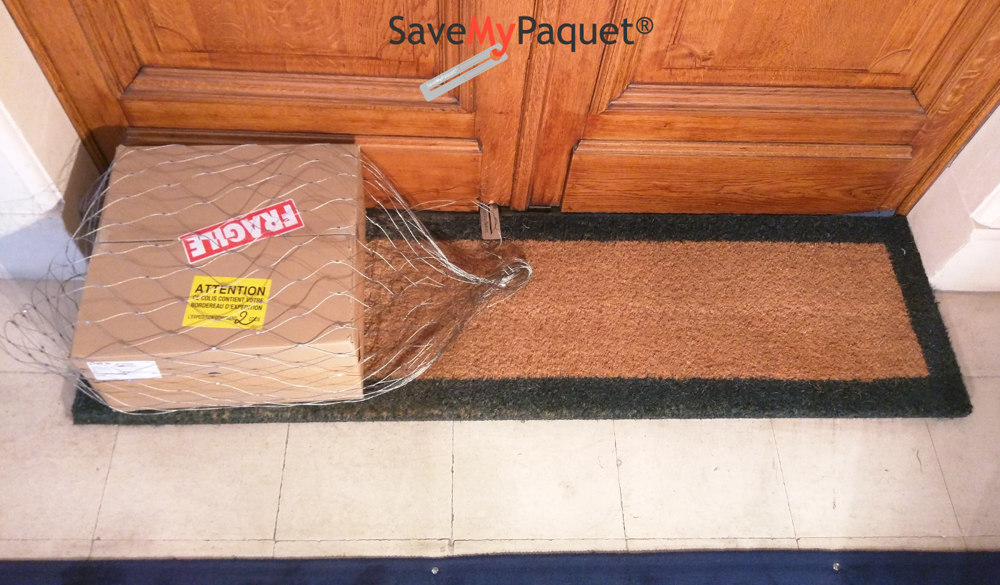

# Présentation

La présente documentation est destiné a l'administrateur de l'application web en ligne, elle décrit les 
nouvelles fonctinalités du nouveau module "Tournées".

# Les fonctionnalités du module.

- La création d’une tournée, et l’ajout des informations de base.
- L’affectation et manipulation  des colis ( en cours ) a la tournée.
- La manipulation des points d’arrêts généré automatiquement: Modification, Suppression, Réorganisation et Optimisation.    
- La validation de la tournée.

